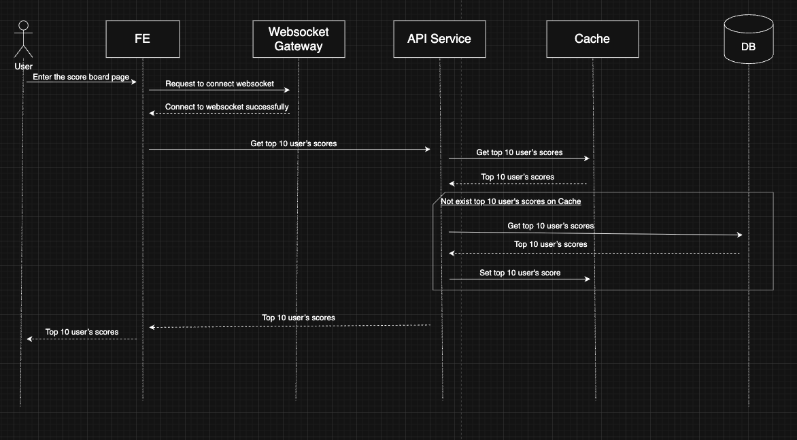
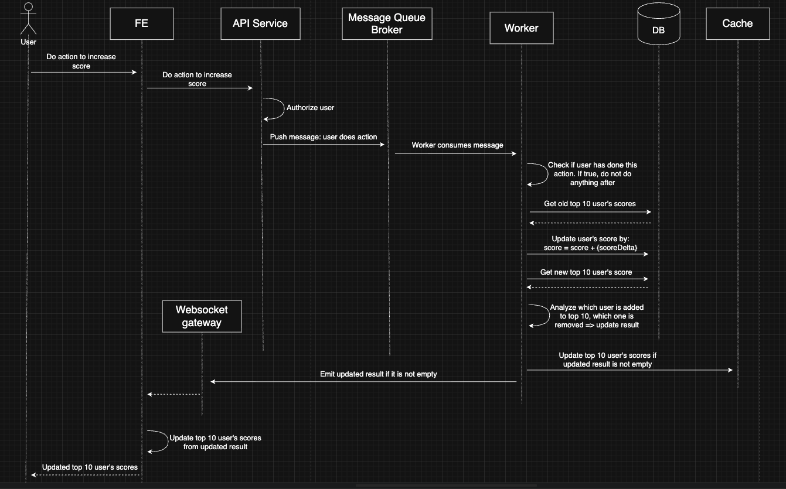

# Scoreboard Module Specification (API Service)

## Overview

This module provides APIs and backend logic to manage user scores and update the public scoreboard in real time. It ensures secure score updates, prevents unauthorized score manipulation, and broadcasts live scoreboard updates.

---

## Objectives

* Maintain a **Top 10 Scoreboard** on the website.
* Enable **real‑time updates** to all clients.
* Allow users to **increase scores** through an authenticated action.
* Prevent **score tampering** and malicious API calls.

---

## Architecture Components

* **API Service** – Processes score‑update requests.
* **Database** – Stores users' total scores.
* **Cache Layer** – Stores Top 10 scoreboard for fast read.
* **Message Queue Broker** – Publishes update events.
* **Worker** – Consume messages from Message Queue Broker, make sure at one time there is only one user's action is handled.
* **WebSocket Gateway** – Pushes live updates to clients.

---

## API Endpoints

### `GET /score/top`

Returns the current Top 10 scoreboard, prioritizing Cache and falling back to the database if the cache is cold.

* **Response**:

```json
{
  "top10Scores": [
    {
      "rank": 1,
      "userId": "user-1",
      "userName": "John Doe",
      "score": 54321,
      "updatedAt": "2025-01-01T00:00:00Z"
    },
    {
      "rank": 2,
      "userId": "user-2",
      "userName": "Alex Mai",
      "score": 54320,
      "updatedAt": "2025-01-01T00:00:01Z"
    }
    // ...
  ]
}
```

* **Flow digram**:




### `POST /score/update`

Updates a user's score after completing an action.

* **Headers**: `Authorization: Bearer <token>`
* **Body**:

```json
{
  "actionId": "string"
}
```

* **Response**:

```json
{ "success": true }
```

* **Flow digram**:



* **Cache behavior**:
  * API reads from Cache first.
  * When the key is missing or expired, API queries the DB, rebuilds the Top 10 list, stores it in Cache, then returns the response.

### Security Requirements

* Request must come from an **authenticated** user.
* The backend must check if **this user has done the action** before.

---

## Score Update Flow

1. User performs a score‑eligible action in the UI; the FE calls `POST /score/update`.
2. API Service authenticates the request, validates the actionId, and immediately enqueues a `UserDidAction` event on the Message Queue Broker (no DB writes yet).
3. Worker consumes events sequentially per user:
   * double‑checks if the user has done the action before;
   * reads the current Top 10 snapshot from Cache (or DB if cache miss) to know the pre‑update ranking.
4. Worker loads the user's latest score from the DB, computes `score = score + scoreDelta`, and persists the new total.
5. Worker recomputes the candidate Top 10 list (DB query or sorted set).
6. Worker compares the old vs new list to determine whether the leaderboard changed (who entered/left/moved).
7. If there is a change, Worker updates the Cache with the refreshed Top 10 payload.
8. Worker sends the diff/payload to the WebSocket gateway (via dedicated channel) so connected clients receive the updated board.
9. WebSocket gateway broadcasts the updated Top 10 to subscribed frontends, which update their UI.

